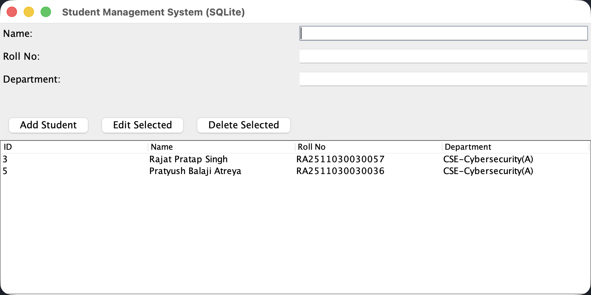
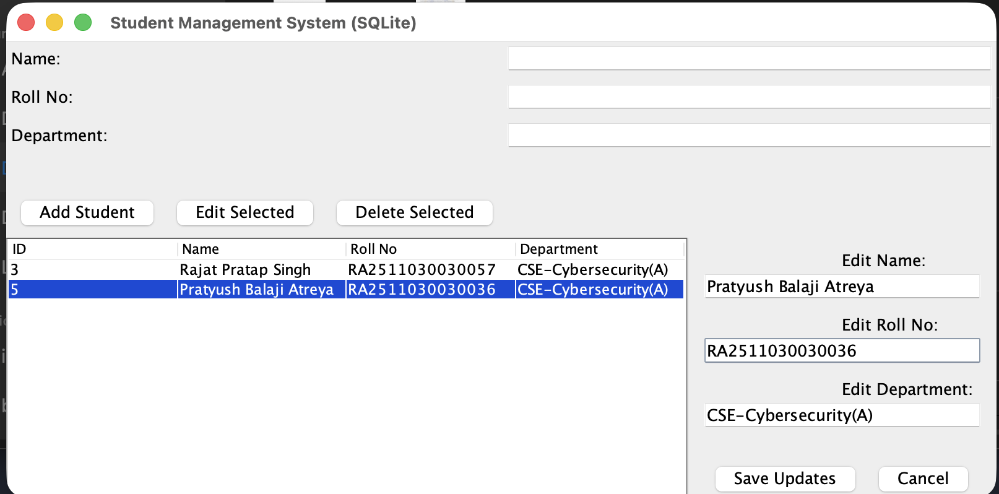

# Student Management System

A simple desktop-based **Student Management System** built using Java Swing for the graphical user interface (GUI) and SQLite for the database. 

## 📸 Screenshots





## 🏗 Project Architecture & Internal Workings

The project is structured into three main layers, following a simplified MVC (Model-View-Controller) / DAO (Data Access Object) pattern:

1. **`AppGUI.java` (View & Controller):** 
   - Handles the Java Swing interface (buttons, text fields, table, and the Side Panel).
   - Listens to user interactions and routes them to the DAO layer.
   - Refreshes the UI (like updating the table) whenever data changes.
2. **`StudentDAO.java` (Data Access Object):**
   - The intermediary between the UI and the database.
   - Contains static methods (`addStudent`, `getAllStudents`, `updateStudent`, `deleteStudent`) that safely execute raw SQL queries (`INSERT`, `SELECT`, `UPDATE`, `DELETE`) using `PreparedStatement`s to prevent SQL injection.
3. **`Database.java` (Configuration):**
   - Manages the SQLite database connection using the SQLite-JDBC driver.
   - Creates the `students.db` file automatically on first run and ensures the `students` table schema exists.
4. **`Student.java` (Model):**
   - A standard Java Object (POJO) representing the structure of a single student record (id, name, rollNo, department).

### Database ID Behavior (Important Note)
If you delete a row, you may notice that the `ID` counter does not reset or shift backward for remaining rows. This is an intended feature of relational databases utilizing `AUTOINCREMENT` primary keys. IDs are meant to be immutable, unique identifiers for the entire lifecycle of a database. Re-using old IDs can accidentally corrupt data relations in larger, complex databases.

## 📁 Project Structure

```text
📁 StudentManagementSystem/
├── lib/
│   ├── slf4j-api.jar        (SLF4J Logging API)
│   ├── slf4j-simple.jar     (SLF4J Simple Binding)
│   └── sqlite-jdbc.jar      (SQLite JDBC Driver)
├── src/
│   ├── AppGUI.java          (Main GUI application)
│   ├── Database.java        (Database connection & initialization)
│   ├── Student.java         (Student model)
│   └── StudentDAO.java      (Data Access Object)
├── build.sh                 (Compilation script for macOS/Linux)
├── run.sh                   (Execution script for macOS/Linux)
├── build.bat                (Compilation script for Windows)
└── run.bat                  (Execution script for Windows)
```

## 🛠 Prerequisites

- **Java Development Kit (JDK)**: You need Java installed on your machine to compile and run this application. (Tested with OpenJDK).

## 🚀 How to Compile & Run (Using Scripts)

For your convenience, build and run scripts have been provided for different operating systems.

### On macOS / Linux
1. Open your terminal in the project directory.
2. Ensure the scripts are executable:
   ```bash
   chmod +x build.sh run.sh
   ```
3. Compile the project:
   ```bash
   ./build.sh
   ```
4. Run the application:
   ```bash
   ./run.sh
   ```

### On Windows
1. Open Command Prompt or PowerShell in the project directory.
2. Compile the project:
   ```cmd
   build.bat
   ```
3. Run the application:
   ```cmd
   run.bat
   ```

*(Note: The `run` scripts automatically include the `--enable-native-access=ALL-UNNAMED` flag to suppress warnings related to the SQLite native JDBC driver loading on Java 22+).*

## ✨ Features
- **Add Student:** Insert a student's Name, Roll No, and Department into the SQLite database.
- **Edit Student (Side Panel):** Select a student from the table, click "Edit Selected", and a side panel will dynamically open allowing you to update and save any parameter.
- **View Students:** Automatically lists all students fetched from the database in a table.
- **Delete Student:** Select a student from the table and delete them directly from the database.

## 🐳 Docker Support

While this project is written in Java and Java can easily run in Docker containers, **this specific project is a Desktop GUI application using Java Swing.** 

Docker containers are traditionally "headless" (they do not have graphical displays). Running a GUI application inside Docker requires advanced configurations like mapping the host's X11 socket to the container or running a VNC server inside the container. 

For standard desktop use, it is highly recommended to run this natively using the provided `run.sh` or `run.bat` scripts rather than Docker.

## 🤝 Git & Collaboration
This project has been initialized as a Git repository. To collaborate and push this to a remote private repository, you can run the following commands:
```bash
git remote add origin <YOUR_PRIVATE_REPO_URL>
git branch -M main
git push -u origin main
```
